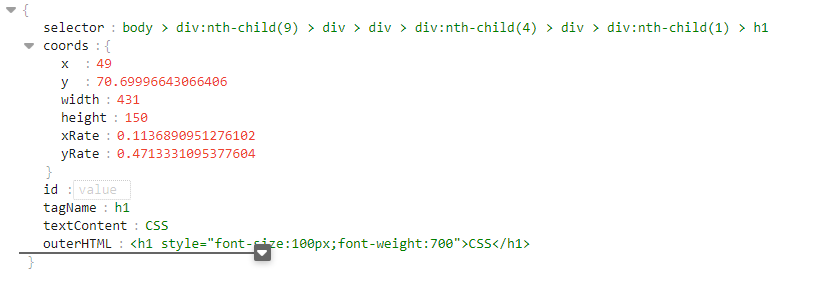
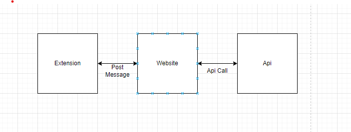
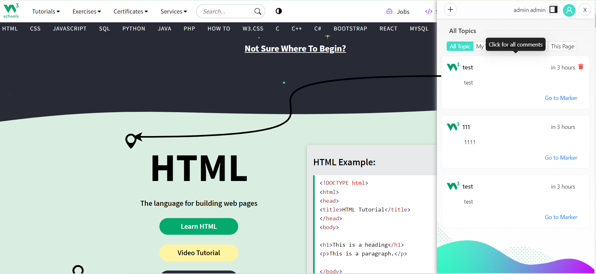
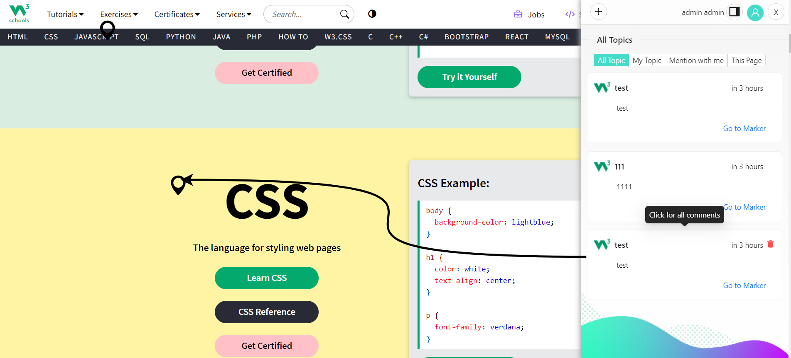
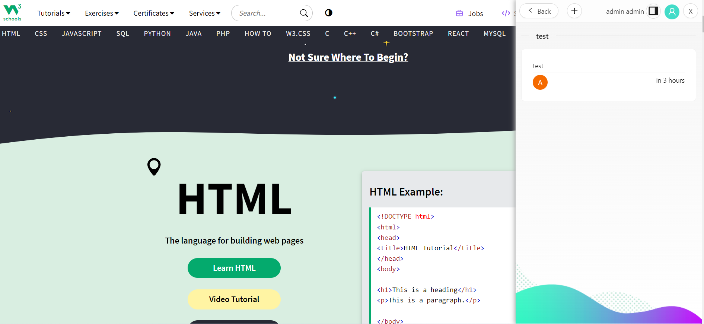
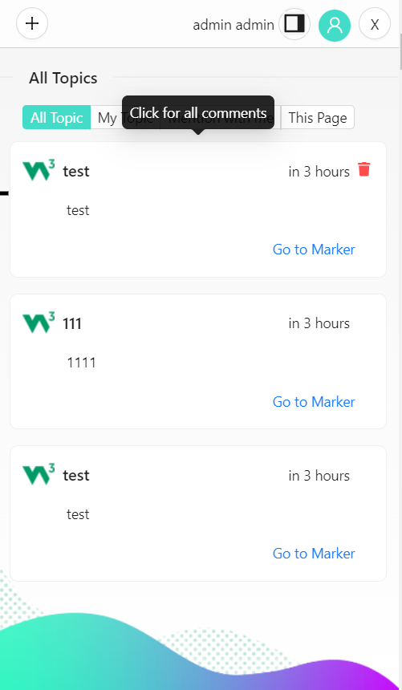

# MarkerFlow Chrome Extension

Marker Flow is a simple Chrome application that allows you to create a new topic on a website, support it with a marker, or add a comment to an existing topic. The project includes a web site and an extension both written in React, as well as a GitHub repository containing an API developed using .NET Core. Backend operations are implemented using the ABP (Asp.Net Boilerplate) framework, supporting basic CRUD (Create, Read, Update, Delete) operations and enabling the system to be multitenant.
The project operates within an iframe between the web site and the extension, facilitating data exchange through the use of postMessage. Both sides trigger their own events and listen for incoming data from the other.
The web site communicates the positions of pins and cards to the extension, while the extension sends back the position of the created pin to the web site. The extension scans the DOM every second to find the positions of pins and uses multiple pieces of data to determine the pin's location. An example pin data can be found below.

 
{
  "selector": "body > div:nth-child(9) > div > div > div:nth-child(4) > div > div:nth-child(1) > h1",
  "coords": {
    "x": 49,
    "y": 70.69996643066406, 
    "width": 431,
    "height": 150,
    "xRate": 0.1136890951276102, 
    "yRate": 0.4713331095377604
  },
  "id": "",
  "tagName": "h1",
  "textContent": "CSS",
  "outerHTML": "<h1 style=\"font-size:100px;font-weight:700\">CSS</h1>"
}

# Project Setup Instructions

Follow these steps to set up the development environment for the "markerFlow Chrome Extension" project:

## Step 1: Run the Backend Host

Navigate to the backend project directory and run the host.

## Step 2: Run the Website

```bash
cd website
yarn install
yarn run dev
```
## Step 2: Load Extension in Chrome
```bash
Open Google Chrome.
Navigate to chrome://extensions/.
Enable "Developer mode" in the top right corner.
Click on "Load unpacked" and select the dist folder in your extension project.
The extension is now loaded in your Chrome browser.
```

## Artitecture

This project involves three main components: the Chrome Extension, the Web Site, and the API.

 **Extension:**: Extension:
The extension operates by running the website within an iframe and communicates through post message to send and receive data.

 **Web Site:** :It is a web application running inside an iframe, capable of receiving and sending data through post message in communication with the extension.
 

 **Api:** Our backend services perform CRUD (Create, Read, Update, Delete) operations using Axios to facilitate data exchange between the extension and the web application.

 

 ## ScreenShots

 

 
 
 
  
